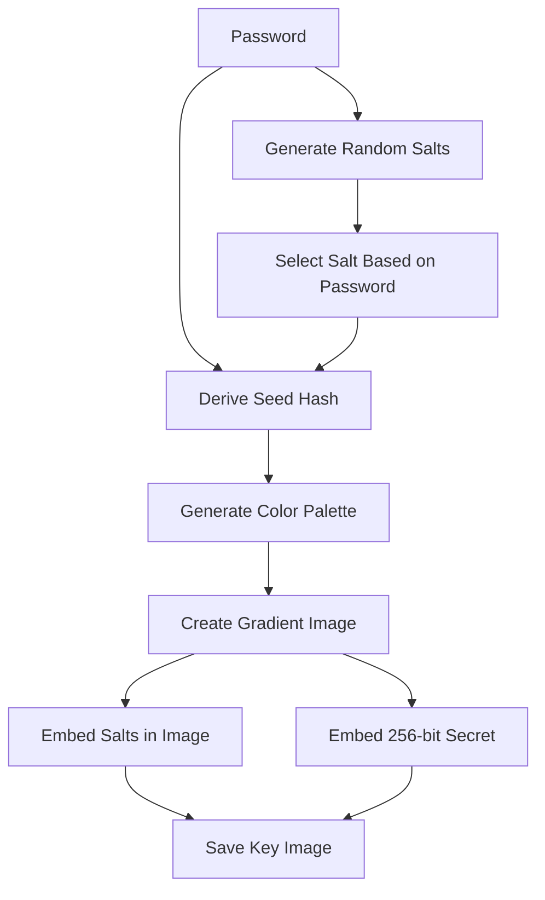
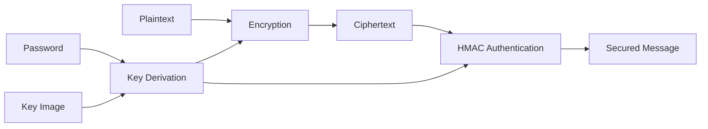
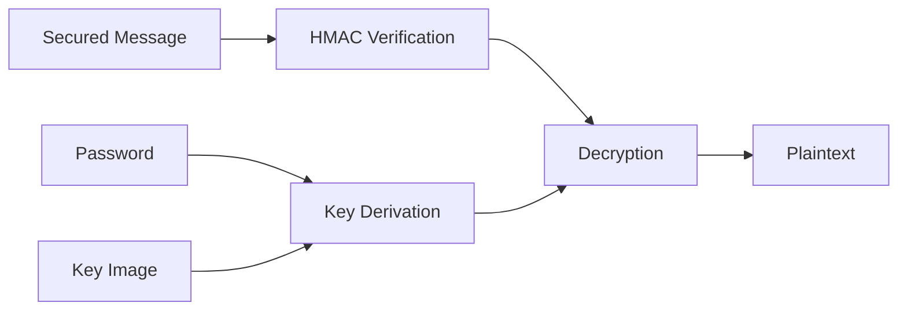

# Steganographic Encryption System

## Overview
This system combines steganography (hiding data in images) with strong cryptography to securely encrypt messages. The core innovation is using a dynamically generated gradient image as a cryptographic key carrier, where secrets are embedded in the image's pixel data using Least Significant Bit (LSB) techniques.

## How It Works
### Key Components
1. **Gradient Key Image**: A visually appealing gradient image generated from your password
2. **Embedded Secrets**: Cryptographic salts and a 256-bit secret hidden in the image
3. **Multi-Layer Encryption**: Combines PBKDF2 key stretching, AES-256 encryption, and HMAC authentication

### Security Features
- **256-bit Security**: Military-grade encryption standards
- **Tamper Detection**: HMAC-SHA512 authentication prevents ciphertext modification
- **Memory Protection**: Sensitive data securely wiped after use
- **Password Hardening**: 600,000 PBKDF2 iterations

---

### 1. Image Generation


### 2. Encryption Process


### 3. Decryption Process


---

# Usage Guide

## Prerequisites

- Python 3.8+

### Install dependencies:

```bash
pip install pillow pycryptodome
```

---

## Generating a Key Image

```python
from stego_crypto import generate_gradient_key_image

password = "YourStrongPassword123!"
output_path = "secure_gradient.png"
generate_gradient_key_image(password, output_path)
```

---

## Encrypting a Message

```python
from stego_crypto import encrypt_text_to_file

plaintext = "Top secret message"
image_path = "secure_gradient.png"
output_file = "encrypted.sec"
encrypt_text_to_file(plaintext, password, image_path, output_file)
```

---

## Decrypting a Message

```python
from stego_crypto import decrypt_text_from_file

decrypted = decrypt_text_from_file(image_path, password, output_file)
print("Decrypted message:", decrypted)
```

---

# Security Best Practices

- **Use Strong Passwords:** Minimum 12 characters with mixed character sets  
- **Rotate Key Images:** Generate new images for important communications  
- **Secure Storage:** Keep key images separate from encrypted files  
- **Secure Deletion:** Destroy key images after use for forward secrecy  
- **Limit Exposure:** Decrypt messages in secure environments only  

---

# Technical Specifications

## Cryptographic Parameters

| Component         | Specification           |
|-------------------|-------------------------|
| Key Size          | 256-bit                 |
| Encryption        | AES-256-CBC             |
| Authentication    | HMAC-SHA512             |
| Key Derivation    | PBKDF2-HMAC-SHA256 (600k iterations) |
| Key Expansion     | HKDF-SHA512             |
| Salt Size         | 32 bytes                |
| Image Secret      | 32 bytes (256-bit)      |

## Image Specifications

| Parameter         | Value                   |
|-------------------|-------------------------|
| Image Size        | 800 x 300 px            |
| Salt Bar Height   | 32 px                   |
| Number of Salts   | 4                       |
| Color Sections    | 10                      |
| LSB Channels      | Blue channel            |

---

# Threat Model

## Protected Against:

- Brute-force attacks (256-bit security)  
- Ciphertext tampering (HMAC authentication)  
- Rainbow table attacks (unique per-image salts)  
- Memory scraping (secure wiping)  
- Known-plaintext attacks  

## Potential Vulnerabilities:

- **Weak Passwords:** System security depends on password strength  
- **Image Modification:** Tampered images will break decryption  
- **Physical Access:** Attackers with device access may extract keys  
- **Side-channel Attacks:** Not fully protected against timing attacks  

---

# Frequently Asked Questions

**Q:** Why use images for cryptography?  
**A:** Images provide plausible deniability and add an extra layer of obscurity while carrying cryptographic material.  

**Q:** Can I use the same image multiple times?  
**A:** Yes, but for maximum security, generate a new image for each message.  

**Q:** How secure is this compared to standard encryption?  
**A:** When used with strong passwords, it provides security equivalent to AES-256 with additional steganographic protection.  

**Q:** What happens if I lose the key image?  
**A:** Without the exact key image used during encryption, decryption is impossible.  

**Q:** Can I use this for large files?  
**A:** The system is designed for text messages. For large files, consider hybrid encryption.  

---

# License

This project is licensed under the **MIT License**.  
Commercial use requires additional permissions.  

---

# Security Disclosures

To report security vulnerabilities, please contact: **security@example.com**  
We operate a responsible disclosure policy.
